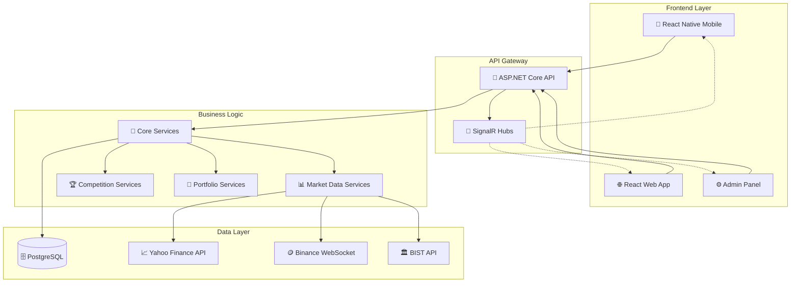
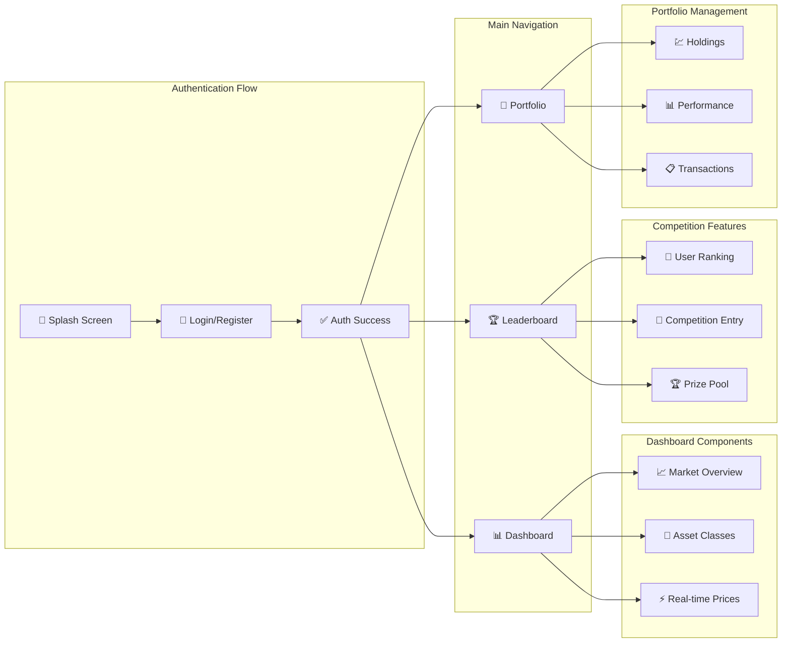
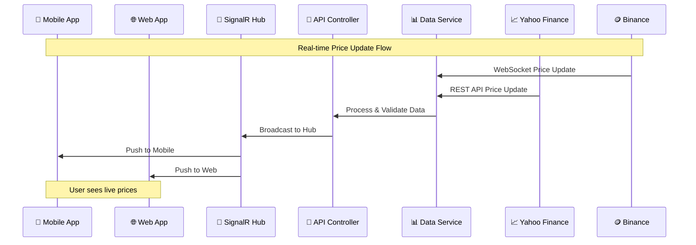
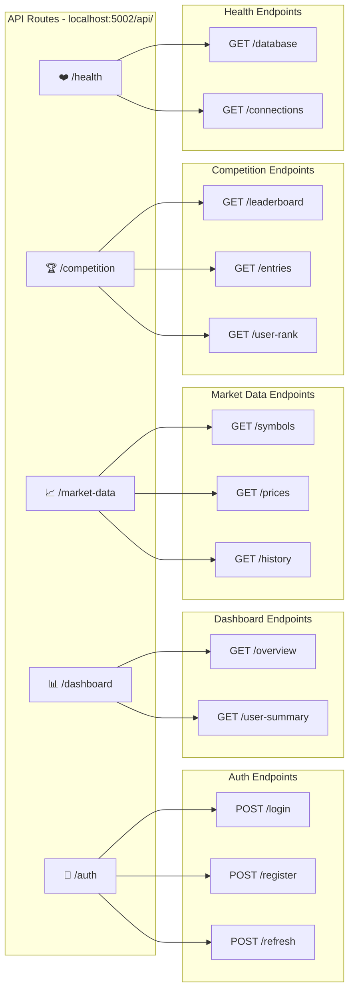
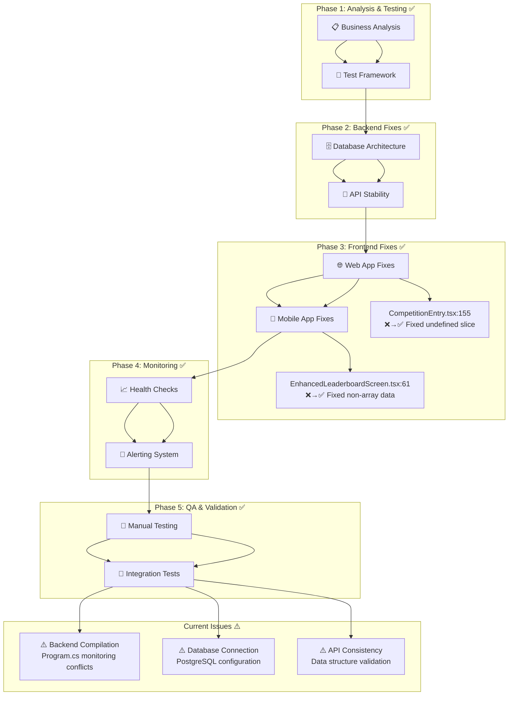
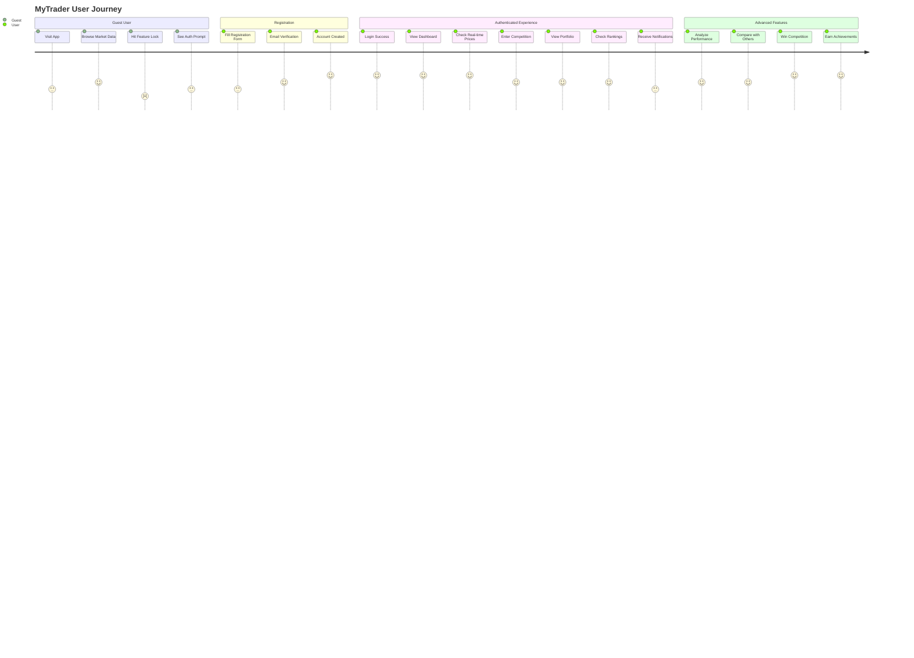

# 📊 MyTrader - Visual Project Architecture & Flow Diagrams

## 🏛️ System Architecture Overview



## 📱 Mobile App Screen Flow



## 🔄 Real-time Data Flow



## 🗂️ File Structure Tree

```
myTrader/
│
├── 🔧 backend/
│   ├── MyTrader.Api/
│   │   ├── 🎯 Controllers/
│   │   │   ├── AuthController.cs ────────── 🔑 Authentication
│   │   │   ├── DashboardController.cs ───── 📊 Dashboard Data
│   │   │   ├── MarketDataController.cs ──── 📈 Market Information
│   │   │   ├── CompetitionController.cs ─── 🏆 Competitions
│   │   │   └── HealthController.cs ─────── ❤️ System Health
│   │   ├── 📡 Hubs/
│   │   │   └── MarketDataHub.cs ─────────── ⚡ Real-time Communication
│   │   ├── 🛠️ Services/
│   │   │   ├── MultiAssetDataBroadcastService.cs
│   │   │   ├── DatabaseSeederService.cs
│   │   │   └── MockServices/
│   │   └── Program.cs ──────────────────── 🚀 Application Entry
│   │
│   ├── MyTrader.Core/
│   │   ├── 📋 Models/ ──────────────────── 🗃️ Data Models
│   │   ├── 📦 DTOs/ ────────────────────── 📤 Data Transfer Objects
│   │   ├── 🔌 Interfaces/ ─────────────── 📜 Service Contracts
│   │   └── ⚙️ Services/ ────────────────── 🏢 Business Logic
│   │
│   ├── MyTrader.Infrastructure/
│   │   ├── 🗄️ Data/ ────────────────────── 💾 Database Context
│   │   ├── 🔗 Services/ ────────────────── 🌐 External APIs
│   │   └── 🧩 Extensions/ ──────────────── 🔧 Service Extensions
│   │
│   └── MyTrader.Services/
│       ├── 📊 Market/ ──────────────────── 📈 Market Data Services
│       ├── 💼 Portfolio/ ───────────────── 💹 Portfolio Management
│       ├── 🏆 Gamification/ ────────────── 🎮 Competitions & Rewards
│       └── 📈 Analytics/ ───────────────── 📊 Performance Analytics
│
├── 🌐 frontend/
│   ├── web/ ────────────────────────────── 🖥️ React Web Application
│   │   ├── src/
│   │   │   ├── 🧩 components/
│   │   │   │   ├── dashboard/
│   │   │   │   │   ├── MarketOverview.tsx ──── 📈 Market Summary
│   │   │   │   │   ├── LeaderboardSection.tsx ─ 🏆 Rankings Display
│   │   │   │   │   └── SmartOverviewHeader.tsx ─ 📊 Header Info
│   │   │   │   ├── AuthPrompt.tsx ────────── 🔑 Login Modal
│   │   │   │   ├── ErrorBoundary.tsx ───── 🛡️ Crash Prevention
│   │   │   │   ├── Login.tsx ──────────── 👤 Login Form
│   │   │   │   └── Register.tsx ────────── 📝 Registration
│   │   │   ├── 🔗 services/
│   │   │   │   ├── api.ts ──────────────── 🌐 API Client
│   │   │   │   ├── authService.ts ────── 🔐 Authentication
│   │   │   │   ├── marketDataService.ts ─ 📊 Market Data
│   │   │   │   └── websocketService.ts ── ⚡ Real-time Connection
│   │   │   ├── 🎣 hooks/ ────────────────── ⚛️ React Custom Hooks
│   │   │   ├── 🏪 store/ ────────────────── 📦 State Management
│   │   │   ├── 🔧 utils/
│   │   │   │   ├── dataValidation.ts ──── ✅ Safe Data Handling
│   │   │   │   └── navigation.ts ──────── 🧭 Safe Navigation
│   │   │   ├── App.tsx ──────────────────── 🏠 Main Component
│   │   │   └── index.tsx ───────────────── 🚀 Entry Point
│   │   └── 🧪 e2e/ ──────────────────────── 🔬 End-to-End Tests
│   │
│   ├── mobile/ ─────────────────────────── 📱 React Native App
│   │   ├── src/
│   │   │   ├── 🧩 components/
│   │   │   │   ├── dashboard/
│   │   │   │   │   ├── AssetClassAccordion.tsx ── 📂 Asset Categories
│   │   │   │   │   ├── CompactLeaderboard.tsx ─── 🏆 Quick Rankings
│   │   │   │   │   └── SmartOverviewHeader.tsx ── 📱 Mobile Header
│   │   │   │   ├── leaderboard/
│   │   │   │   │   ├── CompetitionEntry.tsx ──── 🎯 Competition Cards
│   │   │   │   │   └── UserRankCard.tsx ──────── 👤 User Ranking
│   │   │   │   └── ErrorNotification.tsx ──── 🚨 Error Display
│   │   │   ├── 📺 screens/
│   │   │   │   ├── DashboardScreen.tsx ──────── 🏠 Main Dashboard
│   │   │   │   ├── EnhancedLeaderboardScreen.tsx ─ 🏆 Competition Screen
│   │   │   │   └── PortfolioScreen.tsx ─────── 💼 Portfolio View
│   │   │   ├── 🌐 context/
│   │   │   │   └── PriceContext.tsx ───────── 💰 Price Management
│   │   │   ├── 🔗 services/
│   │   │   │   ├── api.ts ──────────────────── 📱 Mobile API
│   │   │   │   └── websocketService.ts ────── ⚡ Mobile WebSocket
│   │   │   ├── 🔧 utils/
│   │   │   │   └── errorHandling.ts ───────── 🛡️ Error System
│   │   │   └── config.ts ─────────────────── ⚙️ Configuration
│   │   ├── App.tsx ──────────────────────── 📱 Mobile Entry
│   │   └── index.ts ─────────────────────── 📲 Expo Entry
│   │
│   └── backoffice/ ─────────────────────── ⚙️ Admin Panel
│
└── 📚 documentation/
    ├── api-contracts/ ─────────────────── 📜 API Specs
    ├── monitoring/ ───────────────────── 📈 Monitoring Docs
    ├── testing/ ──────────────────────── 🧪 Test Documentation
    └── deployment/ ───────────────────── 🚀 Deployment Guides
```

## 📱 Mobile Navigation Structure

```mermaid
graph TB
    subgraph "Bottom Tab Navigation"
        A[📊 Dashboard<br/>DashboardScreen.tsx]
        B[🏆 Competition<br/>EnhancedLeaderboardScreen.tsx]
        C[💼 Portfolio<br/>PortfolioScreen.tsx]
    end

    subgraph "Dashboard Components"
        A --> A1[📈 SmartOverviewHeader]
        A --> A2[📂 AssetClassAccordion]
        A --> A3[🏆 CompactLeaderboard]

        A2 --> A2a[📈 Stocks<br/>BIST/NASDAQ]
        A2 --> A2b[🪙 Crypto<br/>BTC/ETH/etc]
        A2 --> A2c[🏛️ Other Assets]
    end

    subgraph "Competition Components"
        B --> B1[👤 UserRankCard]
        B --> B2[🎯 CompetitionEntry[]]
        B --> B3[🏅 Global Rankings]

        B2 --> B2a[💰 Prize Pool Info]
        B2 --> B2b[👥 Participant Count]
        B2 --> B2c[⏰ Time Remaining]
    end

    subgraph "Portfolio Components"
        C --> C1[💹 Current Holdings]
        C --> C2[📊 Performance Charts]
        C --> C3[📋 Transaction History]
    end
```

## 🔄 API Endpoint Structure



## 🚨 Critical Issues Resolution Map



## 🎯 User Journey Visual Flow



---

## 🏆 Summary

Bu görsel mimari MyTrader platformunun:
- **📱 Multi-platform** (Web + Mobile) yapısını
- **⚡ Real-time** veri akışını
- **🏆 Competition** sistemini
- **📊 Market data** entegrasyonunu
- **🔧 Fixed issues** ve mevcut durumu

göstermektedir. Platform, comprehensive trading yarışma deneyimi sunmak üzere tasarlanmıştır.