# MyTrader Web Frontend User Journey Maps

## Executive Summary

This document defines comprehensive user journeys for MyTrader's web frontend, ensuring seamless experiences for both guest and authenticated users while optimizing for web-specific capabilities and maintaining feature parity with the mobile application.

## 1. Guest User Journey

### 1.1 Landing & First Impression

#### Journey: Discovering MyTrader
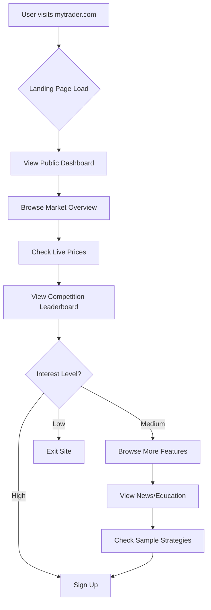

#### Touchpoints & Requirements
1. **Landing Page** (`/`)
   - Hero section with live market data ticker
   - Value proposition: "Trade smarter with AI-powered insights"
   - Call-to-action: "Start Trading" + "View Demo"

2. **Public Dashboard** (`/dashboard`)
   - Real-time market overview without authentication
   - Top movers by asset class (Crypto, BIST, NASDAQ)
   - Public competition leaderboard (anonymized)
   - Market status indicators

3. **Market Data Explorer** (`/market`)
   - Asset class tabs (Crypto, Turkish Stocks, US Stocks)
   - Search functionality for symbols
   - Price charts with technical indicators
   - News feed integration

#### Technical Requirements
- **SSR/SSG**: Server-side rendering for SEO optimization
- **Public APIs**: Market data endpoints without authentication
- **Performance**: < 2s initial page load
- **Responsive**: Mobile-first design with desktop enhancements

### 1.2 Exploration & Education

#### Journey: Learning About Trading
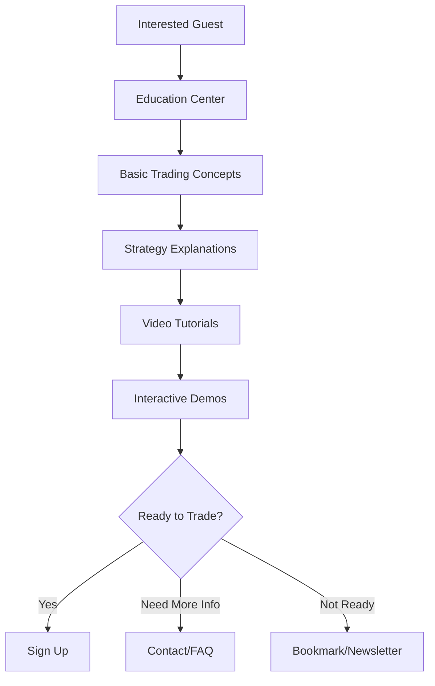

#### Features & Content
1. **Education Hub** (`/learn`)
   - Trading basics and terminology
   - Market analysis techniques
   - Risk management principles
   - Platform walkthrough videos

2. **Strategy Showcase** (`/strategies`)
   - Popular trading strategies explained
   - Backtesting results (anonymized)
   - Performance metrics and analysis

3. **Demo Mode** (`/demo`)
   - Interactive trading simulator
   - Virtual portfolio with paper money
   - Real market data with simulated trades

### 1.3 Registration & Onboarding

#### Journey: Becoming a User
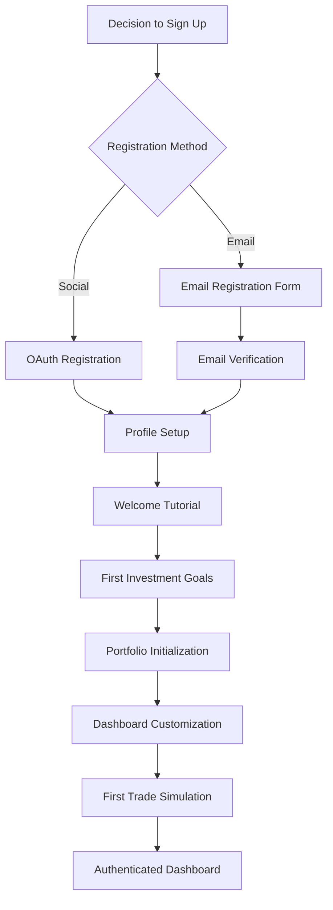

#### Registration Process
1. **Sign-Up Form** (`/register`)
   - Minimal friction: Email, password, name
   - Social login options (Google, Apple)
   - Terms and privacy policy acceptance
   - Email verification flow

2. **Onboarding Wizard** (`/onboarding`)
   - Investment experience assessment
   - Risk tolerance questionnaire
   - Goal setting (short-term, long-term)
   - Preferred asset classes selection

3. **Initial Setup** (`/setup`)
   - Dashboard widget configuration
   - Watchlist creation
   - Notification preferences
   - Mobile app download prompt

## 2. Authenticated User Journey

### 2.1 Daily Active User Flow

#### Journey: Regular Platform Usage
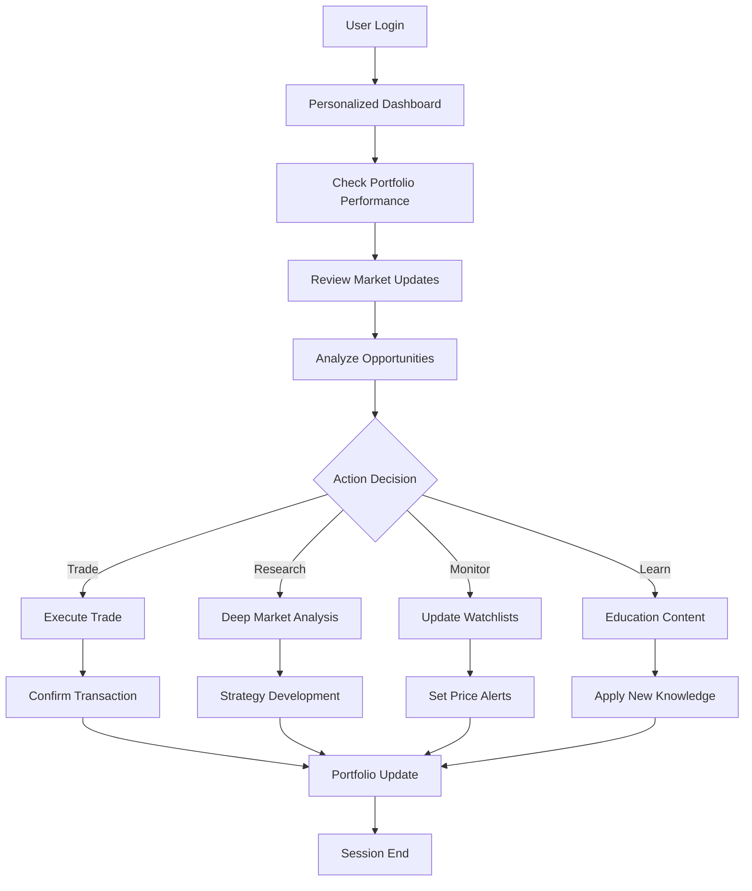

### 2.2 Core Feature Workflows

#### 2.2.1 Portfolio Management Journey
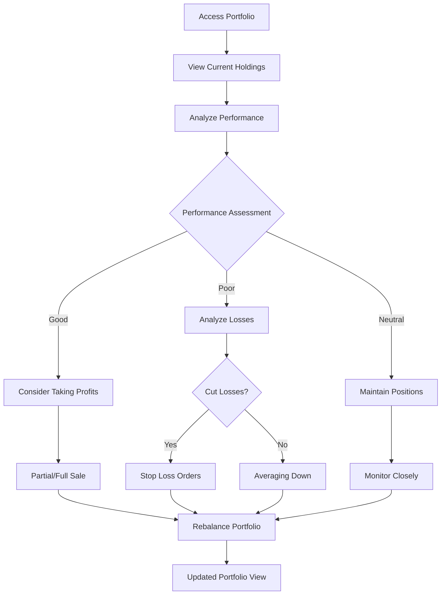

**Key Features:**
- Real-time portfolio valuation
- P&L tracking with detailed analytics
- Asset allocation visualization
- Performance comparison with benchmarks
- Transaction history and reporting

#### 2.2.2 Trading Strategy Journey
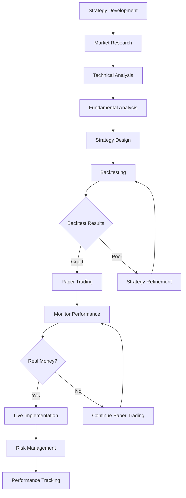

**Advanced Web Features:**
- Multi-monitor strategy dashboard
- Advanced charting with drawing tools
- Custom indicator development
- Automated trading rules
- Strategy sharing community

#### 2.2.3 Competition Participation Journey
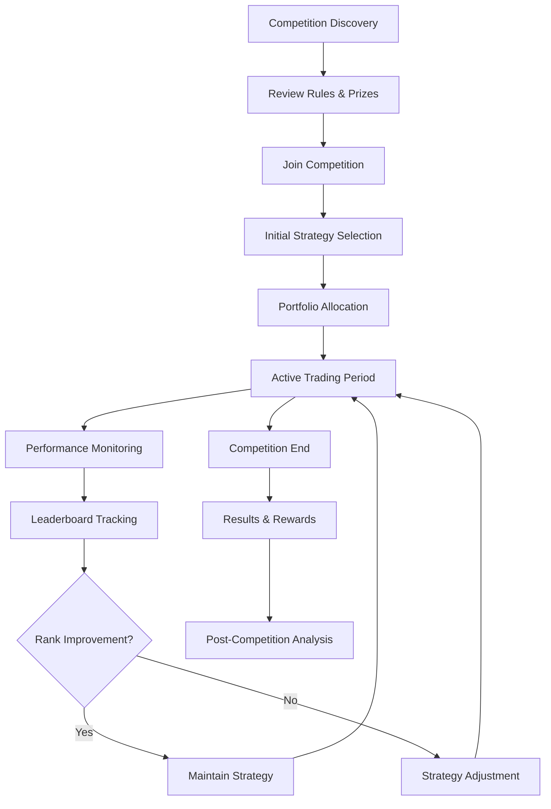

### 2.3 Advanced User Workflows

#### 2.3.1 Professional Trader Journey
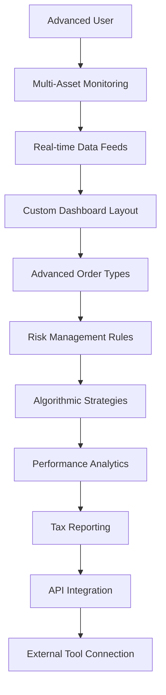

**Professional Features:**
- Level 2 market data
- Advanced order types (OCO, trailing stops)
- Custom dashboard layouts
- API access for third-party tools
- Advanced risk management
- Tax optimization tools

#### 2.3.2 Community & Social Features Journey
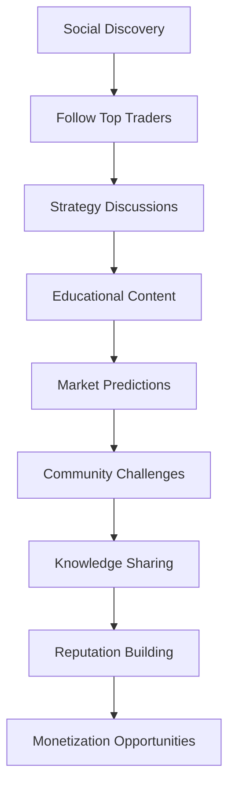

## 3. Cross-Platform Consistency

### 3.1 Feature Parity Matrix

| Feature Category | Mobile App | Web Platform | Notes |
|------------------|------------|--------------|-------|
| **Authentication** | ✅ | ✅ | Identical flow |
| **Market Data** | ✅ | ✅ | Web: Enhanced charts |
| **Portfolio Management** | ✅ | ✅ | Web: Advanced analytics |
| **Real-time Updates** | ✅ | ✅ | Same WebSocket backend |
| **Trading** | ✅ | ✅ | Web: More order types |
| **Competition** | ✅ | ✅ | Identical features |
| **Education** | ✅ | ✅ | Web: Interactive content |
| **Notifications** | Push | Browser | Platform-specific |
| **Offline Mode** | ✅ | Limited | Mobile advantage |
| **Multi-monitor** | ❌ | ✅ | Web advantage |

### 3.2 Data Synchronization Requirements

#### Real-time Sync Points
1. **Portfolio Updates**: Instant across all devices
2. **Watchlist Changes**: < 1 second sync
3. **Order Status**: Real-time updates
4. **Preferences**: Background sync
5. **Competition Scores**: Real-time leaderboard

#### State Management
```typescript
interface SyncState {
  lastSyncTimestamp: number;
  deviceId: string;
  pendingChanges: Change[];
  conflictResolution: 'server-wins' | 'client-wins' | 'merge';
}
```

## 4. Web-Specific Journey Enhancements

### 4.1 Multi-Window Support

#### Journey: Professional Multi-Monitor Setup
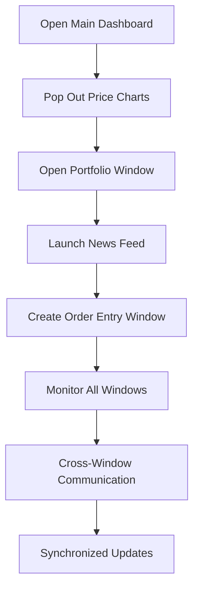

**Technical Implementation:**
- Window state management
- Cross-window messaging
- Synchronized real-time updates
- Independent window controls

### 4.2 Keyboard Shortcuts & Power User Features

#### Hot Keys for Efficiency
```typescript
interface ShortcutMap {
  'Ctrl+N': 'New Order';
  'Ctrl+W': 'Close Position';
  'Ctrl+D': 'Dashboard';
  'Ctrl+P': 'Portfolio';
  'Ctrl+F': 'Search Symbol';
  'Ctrl+L': 'Leaderboard';
  'Ctrl+H': 'Help';
  'Escape': 'Cancel Current Action';
  'Space': 'Quick Trade Modal';
}
```

### 4.3 Advanced Data Visualization

#### Journey: Deep Market Analysis
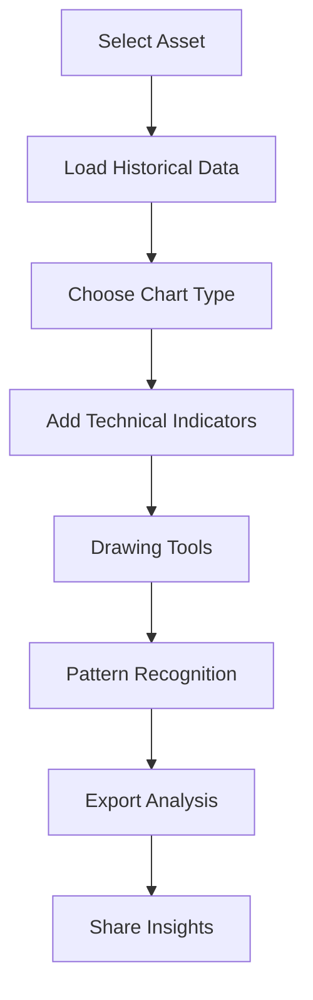

**Enhanced Web Features:**
- TradingView-style charts
- Custom indicator creation
- Pattern recognition AI
- Market correlation analysis
- Export to Excel/PDF

## 5. Error Handling & Edge Cases

### 5.1 Connection Issues

#### Journey: Network Interruption Recovery
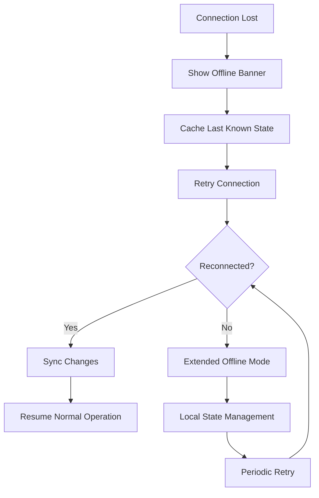

### 5.2 Data Inconsistency

#### Journey: Conflict Resolution
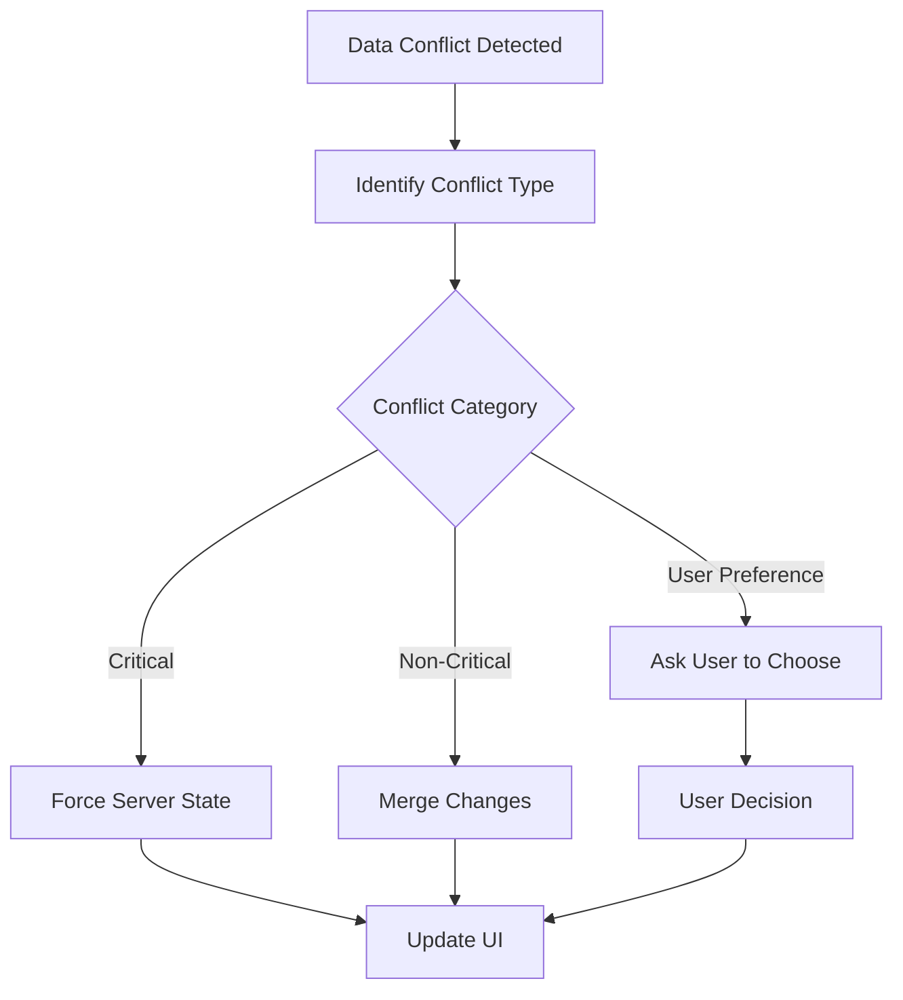

## 6. Success Metrics & KPIs

### 6.1 User Experience Metrics

| Metric | Target | Measurement |
|--------|--------|-------------|
| **Page Load Time** | < 2s | Core Web Vitals |
| **Time to Interactive** | < 3s | Lighthouse |
| **First Contentful Paint** | < 1s | Browser DevTools |
| **Error Rate** | < 0.1% | Error tracking |
| **User Session Duration** | > 15 min | Analytics |
| **Feature Adoption Rate** | > 70% | User behavior |

### 6.2 Business Metrics

| Metric | Target | Impact |
|--------|--------|--------|
| **Guest to Signup Rate** | > 5% | Revenue |
| **Trial to Premium** | > 15% | Revenue |
| **Daily Active Users** | Growth | Engagement |
| **Competition Participation** | > 60% | Retention |
| **Feature Usage Depth** | > 3 features/session | Stickiness |

## 7. Implementation Priorities

### Phase 1: Core Guest Experience (Weeks 1-3)
- [ ] Public dashboard with real-time data
- [ ] Market overview and top movers
- [ ] Public competition leaderboard
- [ ] Registration and authentication
- [ ] Basic responsive design

### Phase 2: Authenticated User Features (Weeks 4-8)
- [ ] Personalized dashboard
- [ ] Portfolio management
- [ ] Watchlist functionality
- [ ] Competition participation
- [ ] Real-time WebSocket integration

### Phase 3: Advanced Features (Weeks 9-12)
- [ ] Advanced charting
- [ ] Multi-window support
- [ ] Keyboard shortcuts
- [ ] Strategy development tools
- [ ] Social features

### Phase 4: Optimization (Weeks 13-16)
- [ ] Performance optimization
- [ ] Advanced analytics
- [ ] Mobile responsiveness
- [ ] Cross-platform testing
- [ ] Launch preparation

---

**Document Version**: 1.0
**Last Updated**: September 28, 2025
**Author**: MyTrader Business Analysis Team